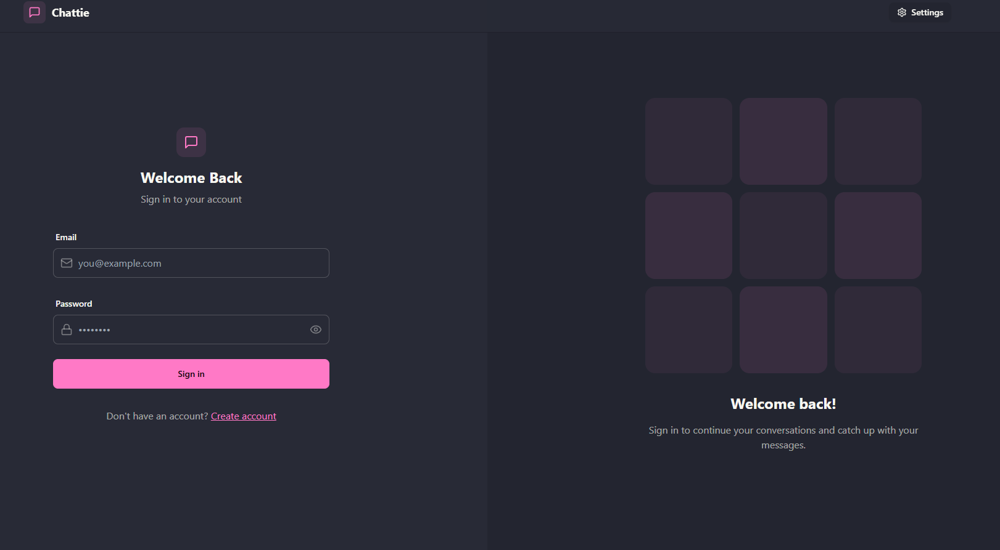
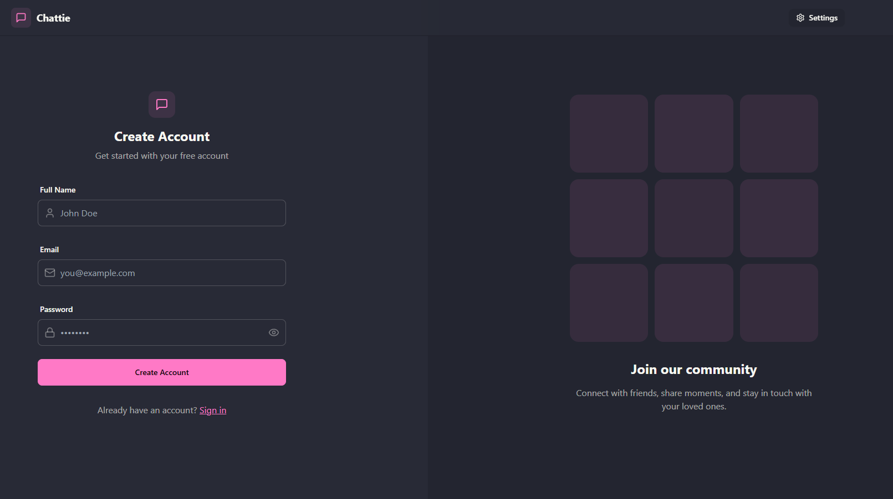
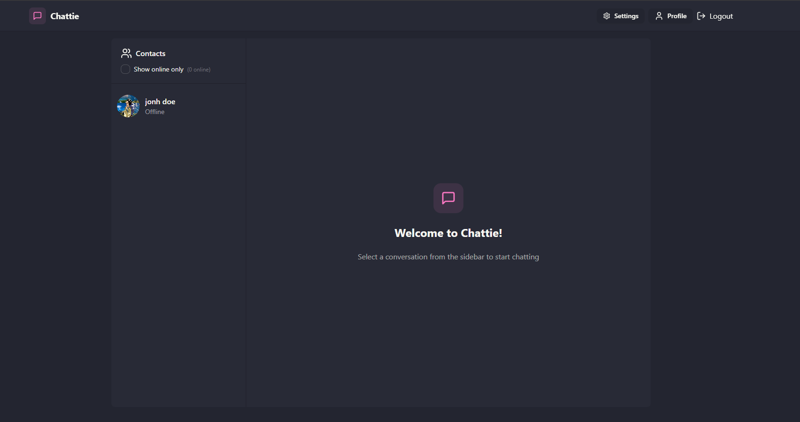
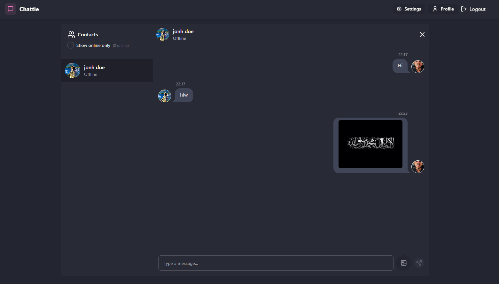
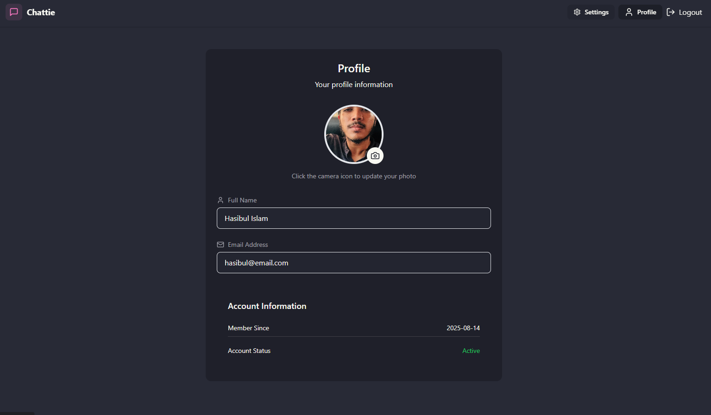
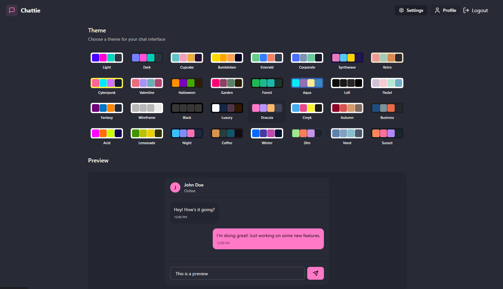
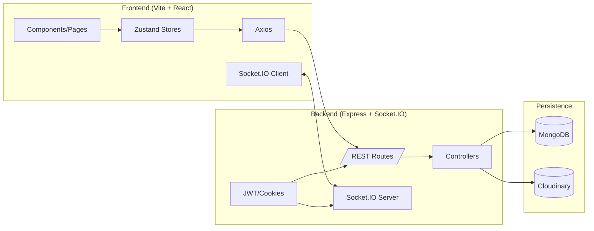

<div align="center">

<h1>Realtime Chat App</h1>

<p>A modern realtime chat platform built with the <strong>MERN</strong> stack, <strong>Socket.IO</strong>, <strong>JWT Auth</strong>, and a clean <strong>Tailwind + DaisyUI</strong> UI.</p>

<p>
  <a href="#features"></a>
  <a href="#-license"></a>
  <a href="mailto:hasibulislam1363@gmail.com"></a>
  
  
  
  
  
</p>

<sub>✨  screenshots below (see <code>  </code>) ✨</sub>

</div>

---

A full‑stack real‑time chat application built with the MERN stack, Socket.IO for bi‑directional events, JWT auth (httpOnly cookies), Cloudinary image uploads, TailwindCSS + DaisyUI for styling, Vite + React on the frontend, and MongoDB + Express on the backend.

---

## 🚀 Features
- User signup / login with hashed passwords (bcrypt) & JWT stored in httpOnly cookie
- Persistent auth check on refresh
- Update profile picture (base64 -> Cloudinary upload)
- Real‑time online user presence via Socket.IO (tracks connected sockets)
- Send / receive chat messages instantly (Socket.IO events + REST fallback)
- Image size validation & basic security checks
- Dark / light theme toggle stored in global state
- Global toast notifications (react-hot-toast)
- State management with Zustand stores (auth / chat / theme)
- Production build serves React app from Express when `NODE_ENV=production`

---

## 🧰 Tech Stack
| Layer | Tech |
|-------|------|
| Frontend | React 18, Vite, TailwindCSS, DaisyUI, Lucide Icons, Zustand, React Router, React Hot Toast |
| Backend | Node.js, Express, Socket.IO, Mongoose, bcryptjs, jsonwebtoken, Cloudinary SDK |
| Database | MongoDB Atlas / local MongoDB |
| Auth | JWT (signed, httpOnly cookie) |
| Realtime | Socket.IO (rooms = implicit by user mapping) |

---

## 🗂️ Project Structure
```
mern-socketio-chat/
  backend/
    src/
      controllers/        # auth & message controllers
      lib/                # db connection, socket server, utils, cloudinary
      middleware/         # auth middleware (JWT verify)
      models/             # Mongoose User & Message schemas
      routes/             # /api/auth & /api/messages
      seeds/              # seed helpers
      index.js            # entrypoint (serves frontend in production)
  frontend/
    src/
      components/         # UI components (chat UI, skeletons, navbar)
      pages/              # Route pages
      store/              # Zustand stores (auth/chat/theme)
      lib/                # axios instance & helpers
      constants/          # shared constants
    public/               # static assets
  package.json            # root scripts (build, start)
```

## ✅ Prerequisites
- Node.js 18+ (for native fetch & performance)
- MongoDB URI (local or Atlas)
- Cloudinary account (for profile image uploads)

## 🔐 Environment Variables
Create `backend/.env`:
```
PORT=5001
MONGODB_URI=your_mongodb_uri
JWT_SECRET=your_jwt_secret_here
CLOUDINARY_CLOUD_NAME=xxxx
CLOUDINARY_API_KEY=xxxx
CLOUDINARY_API_SECRET=xxxx
NODE_ENV=development
```
(Only the first three are absolutely required to start; Cloudinary needed for profile image update.)

## 🛠️ Install & Run (Development)
From the project root:
```bash
# Install both backend & frontend deps
npm install --prefix backend
npm install --prefix frontend

# Start backend (port 5001 by default)
npm run dev --prefix backend

# In another terminal: start frontend (Vite on 5173)
npm run dev --prefix frontend
```
Frontend will proxy API calls if you configure a Vite proxy (not currently set). Currently the backend enables CORS for `http://localhost:5173`.

## 📦 Root Scripts
The root `package.json` defines:
```json
"scripts": {
  "build": "npm install --prefix backend && npm install --prefix frontend && npm run build --prefix frontend",
  "start": "npm run start --prefix backend"
}
```
`npm run build` builds the frontend (output in `frontend/dist`). In production set `NODE_ENV=production` then run `npm start` to serve the built files from Express.

## 🚀 Production Build
```bash
# Build frontend assets
npm run build
# Ensure backend .env has NODE_ENV=production (or export it)
# Start server (serves /frontend/dist static files)
npm start
```
App served at `http://localhost:5001` (adjust if you changed PORT).

## 🔌 Socket.IO Overview
- Server creates an in‑memory `userSocketMap: { userId: socketId }`.
- On connection, client passes `userId` in `socket.handshake.query`.
- Broadcasts `getOnlineUsers` with currently connected user IDs.
- (Extendable) For direct messaging, you can emit to a specific socket by ID.

## 📡 API Endpoints (Auth)
| Method | Route | Description |
|--------|-------|-------------|
| POST | /api/auth/signup | Create account |
| POST | /api/auth/login | Login, set JWT cookie |
| POST | /api/auth/logout | Clear cookie |
| GET | /api/auth/check | Return authenticated user |
| PUT | /api/auth/profile | Update profile picture |

Messages endpoints exist similarly under `/api/messages` (create & fetch conversation—see controller for specifics).

## 🧠 Global State (Zustand)
- `useAuthStore`: auth user, JWT validation, onlineUsers
- `useChatStore`: current conversation, messages (real‑time updates)
- `useThemeStore`: theme preference persisted (likely localStorage)

## 🧹 Running Lint
```bash
npm run lint --prefix frontend
```

## 🧾 Common Tasks
| Task | Command |
|------|---------|
| Install new backend dep | npm install <pkg> --prefix backend |
| Install new frontend dep | npm install <pkg> --prefix frontend |
| Dev (backend) | npm run dev --prefix backend |
| Dev (frontend) | npm run dev --prefix frontend |
| Build frontend | npm run build |
| Start production server | npm start |

## 🐛 Troubleshooting
| Issue | Fix |
|-------|-----|
| MongoDB connection error | Check `MONGODB_URI` and network access (Atlas IP allowlist) |
| CORS error in browser | Ensure backend origin matches `http://localhost:5173` or add env-based origin logic |
| Socket not connecting | Verify client uses same port & passes `userId` query param after auth |
| Profile upload fails | Confirm Cloudinary credentials & that base64 string is below ~6MB |
| JWT not set | Cookies need `credentials: 'include'` on frontend axios/fetch requests |

---

## 🌱 Extending
- Add message rooms / group chats (store room membership in DB)
- Add message attachments (Cloudinary upload + message schema field)
- Pagination / infinite scroll for messages
- Replace in‑memory online map with Redis for horizontal scaling
- Add rate limiting & helmet for security

---

## 🤝 Contributing
1. Fork the repo
2. Create a branch:  
   ```bash
   git checkout -b feature/amazing-feature
   ```
3. Commit changes:  
   ```bash
   git commit -m "Add some amazing feature"
   ```
4. Push to branch:  
   ```bash
   git push origin feature/amazing-feature
   ```
5. Open a Pull Request

---

## 📝 License
This project is licensed under the MIT License - see the [LICENSE](LICENSE) file.

---

## 👨‍💻 Author
 [Hasibul Islam Tamim](mailto:hasibulislam1363@gmail.com)

---

---

## 🧪 Quick Architecture Glance



> Mermaid preview may need a Markdown viewer that supports it (GitHub renders it natively).

---

## 🎯 Roadmap (Sample)
- [ ] Typing indicators
- [ ] Read receipts
- [ ] Group chats
- [ ] Message search & pagination
- [ ] Rich media attachments (images/files)
- [ ] Docker & CI pipeline
- [ ] Notifications (web push)

---

⭐ **Star this repo if you like it!**

<p align="center">Made with ❤️ and a lot of ☕</p>